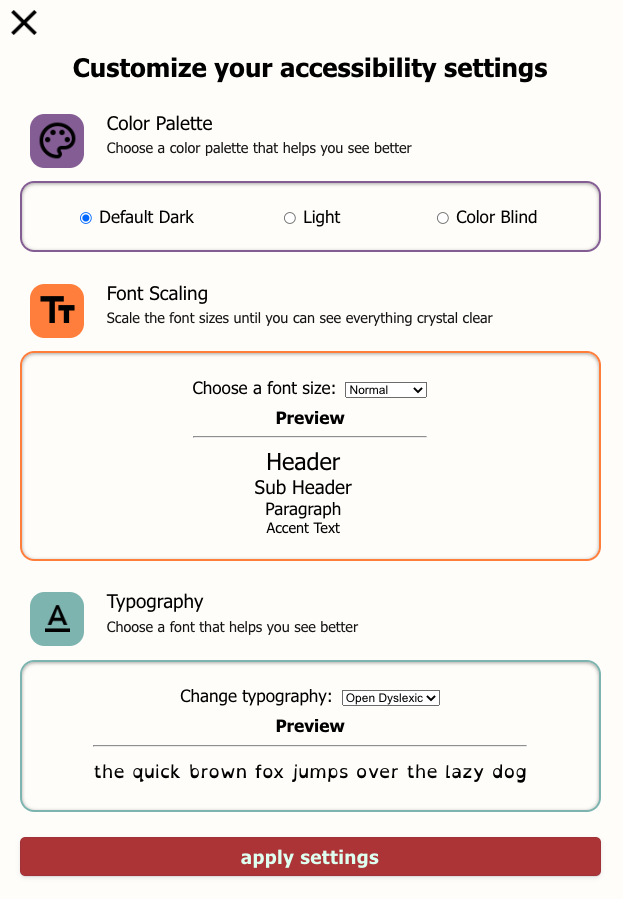
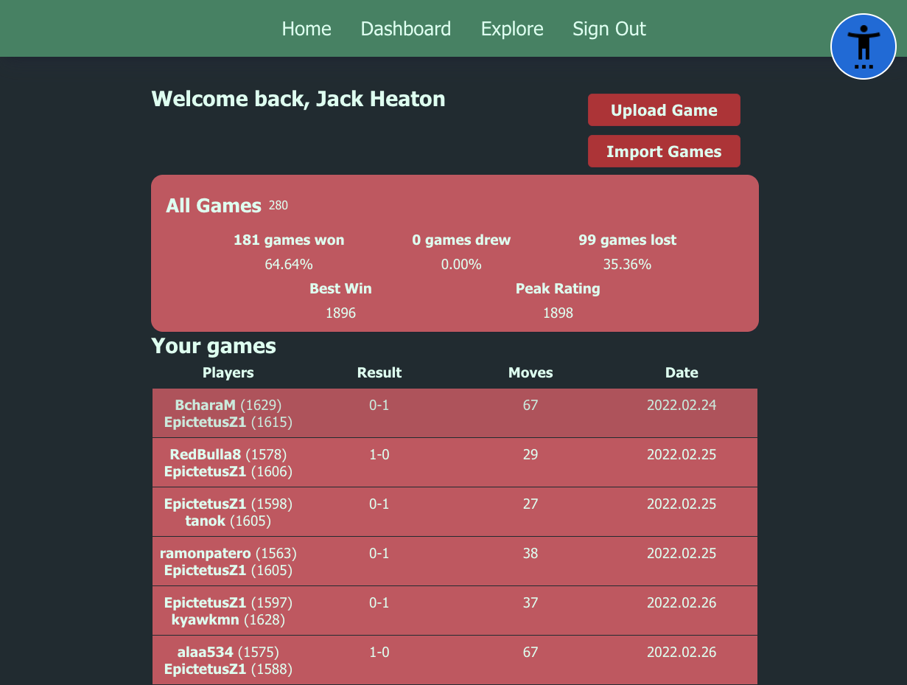
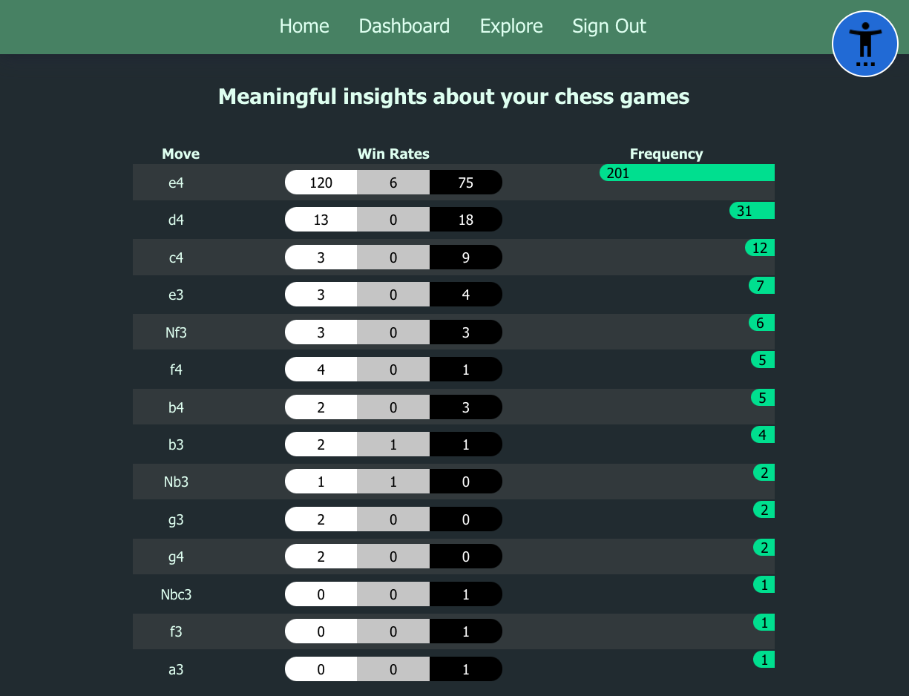
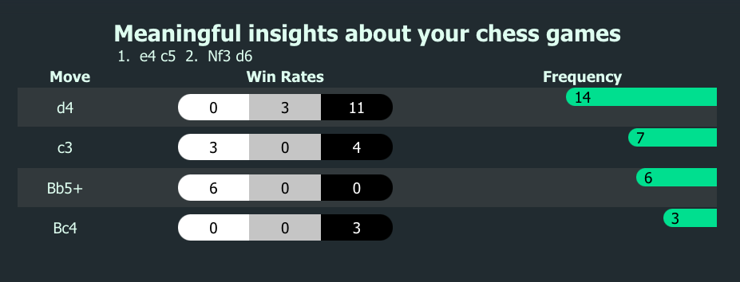
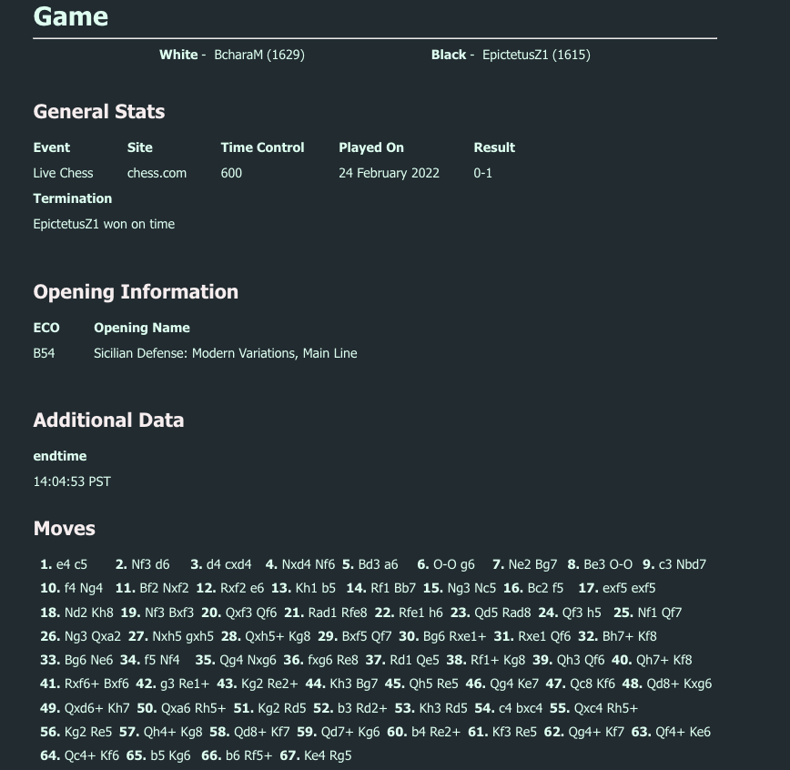

# Arcadia Chess - A Chess Opening Book

## Visually Impaired first approach

### My thinking:

<hr/>

It may be true that the percentage of people who are blind/ partially blind/ or otherwise visually impaired is probably quite low. However, even if that is true, if I can help even a handful of people who have such a condition improve at their chess that is more than enough of a reward to motivate this projects development.

I wanted to create a project that would help me learn about something I wanted to be better at: Web Accessibility.
And what better way to do that then by combining it with something I love (chess), while at the same time getting to help someone out (hopefully).
 
### The goal: 

**To create a site that allows people who may suffer from a visual impairment to gain meaningful insights from their chess games.**

<hr/>

## Table of Contents

  1. [Chess Opening Book](#arcadia-chess---a-chess-opening-book)
  2. [My thinking](#my-thinking)
  3. [The goal](#the-goal)
  4. [Table of Contents](#table-of-contents)
  5. [Functionality](#functionality)
  6. [Pictures](#pictures)
  7. [Technologies](#technologies)
  8. [Things I learned](#things-i-learned)
  9. [License](#license)
  10. [Acknowledgements](#acknowledgements)


## Getting Started

First, run the development server:

```bash
npm run dev
# or
yarn dev
```

Open [http://localhost:3000](http://localhost:3000) with your browser to view and interact with the application.

## Functionality


### There are 4 main pages and 1 core component:

- **Home Page** - Left largely the same as the NextJS default page. This is where you can log in and log out, and navigate to the two other pages.

  <hr/>

- **Accessibility Modal (Component)** - This is an ever present large blue icon in the top right hand corner of the app, which allows you to easily open up all the a11y features of the app. This design decision was made to both make it easier to access the a11y features, and stands to help highlight the importance of easily accessible features in web apps.

    ### Note:

    *The a11y features persist with your userProfile, so on each change - regardless of whether you stay in the app or leave it after - your settings will be there when you log back in.*

    ### The a11y features include:

  - **Dark Mode** - This is a toggle that allows you to switch to a dark theme throughout the app to help with readability and navigation. 
  - **Color Blind Mode** - This is a toggle that allows you to switch between a normal color scheme and an optimized high contrast color scheme that is more easily accessible to people who may be colorblind or have difficulty distinguishing between colors. 
  - **Font Scaling (Size)** - This is a menu that lets you select 4 font size layouts for the app. Each of which changes the size of: Main Headers, Sub-Headers, Paragraphs, and Accent Text. A preview of the font size profiles is shown. When a change is made it immediately applies to the entire app.
  - **Typography** - This allows you to choose form 3 highly readable type faces, and 1 dyslexia friendly type face (OpenDyslexic), ensuring that the app is as readable as possible for all users. A preview of the typeface is shown.

  <hr/>

- **Dashboard** - The main view of a users' data, this has 3 distinct sections, one for viewing some core statistics at a glance, one for viewing a list of your games and a third that allows upload of both single game and multi game PGN files, as well as importing games from LiChess and chess.com.
  - **Core Statistics** - This section shows you some core statistics about your games, such as: Total Games, Total Wins, Total Losses, Total Draws, Best Win (in terms of Elo), and your Peak Rating (Elo).
  - **Game List** - This section shows you a list of all your games, with the most recent game at the top. Each game has a link to the game page, and a link to the "Game" page for that game. At a glance it displays the username of each party involved in the game, the date the game was played, the length of the game in moves, and the result of the game.
  - **Upload / Import Games** - Upload files containing PGN data (can have 1 or hundreds of games per file). Or import last months (ChessCom), or the last 25 games (LiChess) and import them to the database, to be viewed in your game list.

  <hr/>

- **Explore** - This page allows you to explore the opening book, and view the most popular openings, as well as the most popular moves in each opening. This page allows you to see the frequency of a given move at a given ply (half move), it also allows you to see the Win / Loss / Draw rate for the games that have been played with that move. You can view a list of the most popular next moves in your game history for the given sequence, and go back in history by deleting a move (by clicking on the move in the move list). 
    
    ### Note:

    This was an extraordinary challenge for me, as not only do you have to keep track of the frequencies of a move at a given index, but also ensure that the sequence leading up to those moves was the same, only then can you look at index+1 to see the frequency of occurrences for the next move. It was a fantastic learning experience for me and a labour of love.

  <hr/>

- **Game** - A simple displaying showing most of the relevant data for a given Chess Game. Included in my  code is a custom database with over 1000 chess openings, and each time a game is uploaded it finds the opening that matches to the highest degree of accuracy - it does this by starting at ply 16, and working it's way back towards 0, returning the first opening that features a complete sequence match. 
  - So for example if you had the Sicilian Defence ( 1.e4 c5 ), then that game progressed into the Sicilian Najdorf ( 1. e4 c5 2. Nf3 d6 3. d4 cxd4 4. Nxd4 Nf6 5. Nc3 a6 ), then the opening would be listed as Sicilian Najdorf, since it matches to a higher degree of accuracy than just the Sicilian Defence.

<sup>[Back to top](#table-of-contents)</sup>


## Pictures

#### The Accessibility Menu



#### The Dashboard



#### The Explore Page



#### The Explore Page with a game history



#### The Game Page



<sup>[Back to top](#table-of-contents)</sup>

## Technologies

- **TypeScript**
- **NextJS**
  - **NextAuth** - For authentication (GitHub)
  - **React** - obviously
- **Prisma** - For database management
- **MongoDB** - For storing Game, User, Opening, and other data
- **Axios**
- **Styled Components**
- **eslint-plugin-jsx-a11y** - For accessibility linting

<sup>[Back to top](#table-of-contents)</sup>

## Things I Learned

- A better but still far from complete understanding of Web Accessibility (a11y concepts)
- Writing my backend API's in a way that allows them to be more basic, thus serving more app wide functionality
- Writing a full stack app from start to finish
- I now have a near-complete mastery over RegEx, as anyone who has ever personally written the RegEx to match all the possible moves, checks, pawn promotions, inline game comments and computer evaluations will know. 
- The God-Send that is named capture groups, also for reference here is just the regex to match moves:
```regexp
/(?<moves>[0-9]+\.\s?(?<plys>([Oo]-[Oo]-[Oo]{0,2}\s?|[Oo]-[Oo]\s?){0,2}|[KQBNR]?x?\+?[a-h]?[1-8]?x?\+?\s?[KQBNR]?x?[a-h]x?[a-h]?[1-8]=?[QBNR]?\s?x?[+#]?\s?(\s?[0-9]-[0-9]|(1/2-?){0,2})?)*)/gm
```  
- Dealing with File uploads (both temporary and permanent, the former being the option I ended up going with)
- Prisma
- Aggregation Pipelines in MongoDB
- User auth and session management
- Improved my ability to model data before building a complex app
- Color contrast ratios for accessibility best practices
- Complex site-wide theming and theme management

<sup>[Back to top](#table-of-contents)</sup>

## License

Distributed under the MIT License. See `LICENSE.txt` for more information.

<sup>[Back to top](#table-of-contents)</sup>

## Acknowledgements

#### Opening book data:

[LiChess - chess openings](https://github.com/lichess-org/chess-openings)

#### Open Dyslexic Font:
[Abbie Gonzalez](https://github.com/antijingoist) [OpenDyslexic](https://opendyslexic.org/)

<sup>[Back to top](#table-of-contents)</sup>